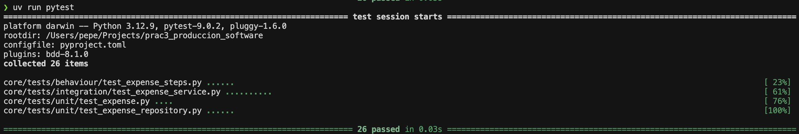
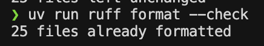
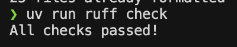
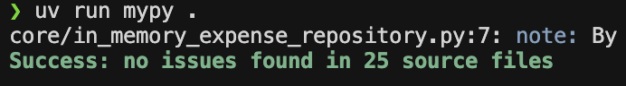
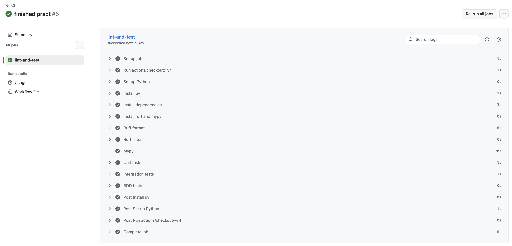

# Presentación de la práctica

[PRESENTACIÓN PRÁCTICA DEVOPS](https://github.com/user-attachments/files/25688169/PS.-.PRACTICA.DEVOPS.ARREGLADA.pdf)


# Instrucciones para ejecutar el repositorio

Este repositorio contiene una pequeña aplicación de gestión de gastos desarrollada en Python, y debe ser utilizada como base para varias prácticas en la asignatura. A continuación se detalla toda la información necesaria para instalar, ejecutar, probar y validar el código, así como los requisitos para la primera y segunda parte de la práctica.


---

## uv como gestor de paquetes de Python

En este proyecto utilizamos **uv** como gestor de paquetes. Un gestor de paquetes es una herramienta que permite instalar, actualizar y gestionar las dependencias de Python de manera sencilla y reproducible.

**uv** es una alternativa moderna y rápida a pip y pipenv. Se encarga de gestionar entornos virtuales y de instalar todos los paquetes necesarios que requiere el proyecto, utilizando para ello el fichero `pyproject.toml` (y, si existe, `uv.lock`) donde se especifican las dependencias.

**Comandos importantes para trabajar con uv:**

- **Instalar todas las dependencias del proyecto (deberás ejecutar este comando antes de hacer nada):**

  ```bash
  uv sync
  ```

- **Instalar una nueva dependencia:**

  Puedes hacerlo de dos formas equivalentes:

  - Utilizando el alias de pip proporcionado por uv:
    ```bash
    uv pip install <nombre-paquete>
    ```

  - Usando el subcomando directo de uv:
    ```bash
    uv add <nombre-paquete>
    ```

- **Ejecutar un comando dentro del entorno virtual gestionado por uv:**

  ```bash
  uv run <comando>
  ```

- **Ejemplo para ejecutar un script o un test:**

  ```bash
  uv run python <archivo.py>
  uv run pytest
  ```

---

## Interfaz web con streamlit

En este proyecto se proporciona una interfaz web básica utilizando **Streamlit**.  
**Streamlit** es una librería de Python que permite crear aplicaciones web interactivas de manera sencilla para visualizar y probar funcionalidades rápidamente.

**IMPORTANTE:**  
La interfaz web en este caso es solo una herramienta auxiliar para facilitar que podáis probar la lógica del proyecto de forma gráfica en vuestro navegador.  
La lógica principal de la aplicación **NO** debe estar acoplada a la interfaz web. Debéis programar toda la lógica (servicios, validaciones, etc.) en el núcleo de la aplicación (`core/`) y solo utilizar Streamlit como una “capa” de presentación.

**Para lanzar la interfaz web ejecuta:**

```bash
uv run streamlit run main.py
```

Esto abrirá automáticamente la interfaz en tu navegador por defecto.

---

## Ejecutar los tests utilizando pytest

Para validar el correcto funcionamiento de la aplicación usamos **pytest**.  
**Pytest** es una herramienta para realizar tests (pruebas automatizadas) en Python de forma sencilla, permitiendo comprobar que todas las partes del código funcionan como se espera.

- **Para lanzar todos los tests ejecuta:**

  ```bash
  uv run pytest
  ```

- **Para una ejecución más detallada:**

  ```bash
  uv run pytest -v
  ```

- **Para especificar un directorio o archivo concreto de tests:**

  ```bash
  uv run pytest core/tests/unit
  uv run pytest core/tests/integration
  uv run pytest core/tests/behaviour
  ```

---

## Linter, formateador y verificación de tipos utilizando ruff y mypy

En este repositorio se utilizan dos herramientas adicionales para asegurar la calidad y robustez del código:

- **Ruff:**  
  Es un linter y formateador para Python muy rápido. Sirve para asegurarnos de que el código sigue las convenciones de estilo y está correctamente formateado.

  - **Comprobar el formato:**
    ```bash
    uv run ruff format --check .
    ```
  - **Formatear el código automáticamente:**
    ```bash
    uv run ruff format .
    ```
  - **Lanzar el linter para buscar problemas:**
    ```bash
    uv run ruff check .
    ```

- **Mypy:**  
  Es una herramienta que verifica los tipos en Python de manera estática. Esto ayuda a evitar errores relacionados con el uso incorrecto de tipos de datos.

  - **Para lanzar la comprobación de tipos:**
    ```bash
    uv run mypy .
    ```

---

# Guión primera práctica

## Guía para completar la primera práctica

Sigue estos pasos para garantizar que tu proyecto cumple todos los requisitos y pasa correctamente los tests y validaciones:

1. **Asegúrate de que todos los tests existentes pasan**
   - Corrige el código inicial si es necesario para que todos los tests actuales funcionen correctamente.

2. **Test Unitarios** (4 en total)
   - Implementa y confirma que todos los tests en `core/tests/unit` están implementados y funcionan correctamente. Los test unitarios validan funcionalidades aisladas, como validaciones de la clase `Expense` o el servicio `ExpenseService`.

3. **Test de Integración** (4 en total)
   - Asegúrate de que los tests de `core/tests/integration` están implementados y se ejecutan correctamente. Estos verifican la interacción entre distintas partes del sistema.

4. **Test de Comportamiento** (6 en total)
   - Trabaja con los tests de comportamiento en `core/tests/behaviour`, que simulan flujos de usuario completos. Hay que implementar los 3 test de expense_management.feature que están vacíos y añadir otros 3 más.

5. **Completa la funcionalidad pendiente**
   - Si algún test falla porque falta implementar alguna parte, añade el código necesario en el directorio `core/` hasta que todos los tests pasen con éxito.

6. **Revisa y valida la calidad del código**
   - Una vez todos los tests pasen, ejecuta los siguientes comandos y soluciona cualquier error que aparezca:

   - Formatea el código comprobando primero el formato:
     ```bash
     uv run ruff format --check .
     ```
   - Ejecuta el linter para buscar problemas de estilo o errores:
     ```bash
     uv run ruff check .
     ```
   - Verifica los tipos estáticos con mypy:
     ```bash
     uv run mypy .
     ```

---

# Guión segunda parte de la práctica

En la segunda parte tendréis que crear integración continua (CI) para el repositorio:

- Crea dentro de la carpeta `.github/workflows` un workflow que se llame `ci.yml` y asegúrate de que ejecuta todos los pasos mencionados arriba (instalación de dependencias, lint, format, mypy, y todos los tests).  
- De esta manera, cada vez que se haga un push al repositorio, se validará automáticamente el código.

Consulta el fichero de ejemplo que tienes ya en `.github/workflows/ci.yml` si lo necesitas. Esta planteado el flujo que vamos a implementar.

Es fundamental que, una vez configurado el workflow hagáis push y verifiquéis en la pestaña "Actions" de GitHub que el flujo de integración continua se ejecuta correctamente y todos los pasos finalizan con éxito. Yo mismo revisaré esta sección para evaluar que la automatización funciona como se espera.

---

# Criterios de validación

Es importante tener en cuenta que estos criterios de validación son imprescindibles, pero no garantizan por sí solos que la práctica esté correctamente realizada. Si los tests proporcionados no están bien implementados, incompletos o simplemente vacíos, todos los comandos podrían indicar que "todo está bien" porque no se está comprobando realmente la funcionalidad. Por tanto, además de cumplir estos pasos, asegúrate de que los tests sean realmente efectivos y cubran los casos necesarios; de lo contrario, la práctica no estará bien hecha.

A continuación, se detallan los comandos y comprobaciones que debes realizar para validar tu proyecto:

1. Ejecutar todos los tests usando pytest:
   ```bash
   uv run pytest
   ```
   

2. Comprobar el formato del código:
   ```bash
   uv run ruff format --check
   ```
   

3. Pasar el linter para detectar errores de estilo:
   ```bash
   uv run ruff check
   ```
   

4. Verificar los tipos estáticos con mypy:
   ```bash
   uv run mypy .
   ```
   

Por último, asegúrate de que la integración continua de GitHub Actions se ejecuta correctamente tras hacer push, comprobando en la pestaña "Actions" de tu repositorio que todos los pasos han pasado con éxito:




